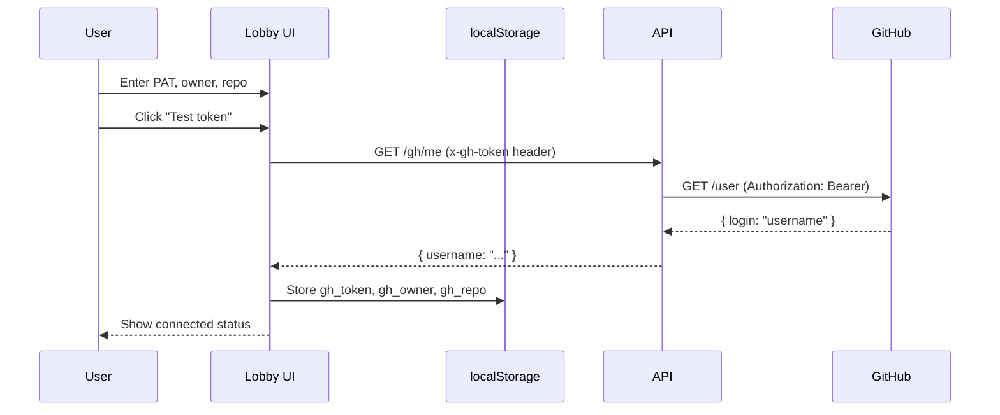

# GitHub PAT Authentication — Design

## Overview

This feature implements a client-side GitHub PAT authentication flow for Spectral Diff. The architecture prioritizes security and simplicity: tokens are stored only in the browser's localStorage and passed to the API via headers on each request. The API acts as a stateless proxy to GitHub, never persisting tokens.

## Architecture



## Components and Interfaces

### Web Components

#### GitHubConnectBox
Location: `apps/web/src/components/GitHubConnectBox.tsx`

```typescript
interface GitHubConnectBoxProps {
  onConnect: (credentials: GitHubCredentials) => void;
  onDisconnect: () => void;
}

interface GitHubCredentials {
  token: string;
  owner: string;
  repo: string;
}

interface ConnectionStatus {
  connected: boolean;
  username?: string;
  rateLimit?: {
    remaining: number;
    limit: number;
    reset: Date;
  };
}
```

#### useGitHubAuth Hook
Location: `apps/web/src/lib/github.ts`

```typescript
interface UseGitHubAuth {
  // State
  isConnected: boolean;
  username: string | null;
  owner: string | null;
  repo: string | null;
  rateLimit: RateLimit | null;
  isLoading: boolean;
  error: string | null;
  
  // Actions
  connect: (token: string, owner: string, repo: string) => Promise<boolean>;
  disconnect: () => void;
  testToken: (token: string) => Promise<{ valid: boolean; username?: string }>;
}
```

### API Endpoints

#### GET /gh/me
Validates token and returns authenticated user info.

Request:
```
GET /gh/me
x-gh-token: ghp_xxxxxxxxxxxx
```

Response (200):
```json
{
  "username": "octocat",
  "avatarUrl": "https://...",
  "rateLimit": {
    "remaining": 4999,
    "limit": 5000,
    "reset": "2024-01-01T12:00:00Z"
  }
}
```

Response (401):
```json
{
  "error": "Invalid or expired token"
}
```

#### GET /gh/rate_limit
Returns current rate limit status.

Request:
```
GET /gh/rate_limit
x-gh-token: ghp_xxxxxxxxxxxx
```

Response (200):
```json
{
  "remaining": 4999,
  "limit": 5000,
  "reset": "2024-01-01T12:00:00Z"
}
```

### API Implementation

Location: `services/api/src/github/auth.ts`

```typescript
// Middleware to extract and validate token
function requireGitHubToken(req: Request, res: Response, next: NextFunction): void;

// GitHub API client factory
function createGitHubClient(token: string): Octokit;

// Route handlers
async function getAuthenticatedUser(req: Request, res: Response): Promise<void>;
async function getRateLimit(req: Request, res: Response): Promise<void>;
```

## Data Models

### localStorage Keys
| Key | Type | Description |
|-----|------|-------------|
| `gh_token` | string | GitHub PAT (encrypted in transit only) |
| `gh_owner` | string | Repository owner |
| `gh_repo` | string | Repository name |

### API Request Headers
| Header | Required | Description |
|--------|----------|-------------|
| `x-gh-token` | Yes | GitHub PAT for authentication |

## Correctness Properties

*A property is a characteristic or behavior that should hold true across all valid executions of a system-essentially, a formal statement about what the system should do. Properties serve as the bridge between human-readable specifications and machine-verifiable correctness guarantees.*

### Property 1: Credential Storage Round-Trip
*For any* valid token, owner, and repo combination, after successful validation and storage, reading from localStorage should return the exact same values that were stored.
**Validates: Requirements 2.1, 2.2, 2.3**

### Property 2: Disconnect Clears All Credentials
*For any* stored credential state, calling disconnect should result in localStorage containing no gh_token, gh_owner, or gh_repo keys.
**Validates: Requirements 3.1, 3.2, 3.3**

### Property 3: Invalid Token Never Stored
*For any* invalid token (rejected by GitHub API), the system should not store the token in localStorage, regardless of owner/repo values provided.
**Validates: Requirements 1.5**

### Property 4: Token Never Displayed
*For any* stored token, the UI should never render the actual token value in any visible element (input value, text content, or attribute).
**Validates: Requirements 2.5**

### Property 5: Missing Token Returns 401
*For any* API request to /gh/* endpoints without x-gh-token header, the API should return HTTP 401 status.
**Validates: Requirements 4.3**

### Property 6: GitHub Errors Forwarded
*For any* error response from GitHub API (4xx or 5xx), the API should forward the status code and include an error message in the response body.
**Validates: Requirements 4.4**

### Property 7: Rate Limit Warning Threshold
*For any* rate limit value below 100, the UI should display a warning indicator (visual distinction from normal state).
**Validates: Requirements 5.2**

## Error Handling

| Error Scenario | UI Behavior | API Behavior |
|----------------|-------------|--------------|
| Invalid PAT | Show "Invalid token" error, clear input | Return 401 with error message |
| Network failure | Show "Connection failed" error | N/A |
| GitHub rate limited | Show rate limit warning with reset time | Forward 403 with rate limit headers |
| Missing token header | N/A | Return 401 "Token required" |
| GitHub API error | Show error message from API | Forward GitHub error status/message |

## Testing Strategy

### Unit Tests
- GitHubConnectBox renders all required fields
- useGitHubAuth hook state transitions
- API middleware token extraction
- localStorage read/write operations

### Property-Based Tests
Using `fast-check` for property-based testing:

1. **Credential round-trip**: Generate random valid credentials, store them, verify retrieval matches
2. **Disconnect completeness**: Generate random credential states, disconnect, verify all keys removed
3. **Token masking**: Generate random tokens, verify they never appear in rendered output
4. **401 on missing token**: Generate random request paths, verify 401 without token
5. **Error forwarding**: Generate random GitHub error responses, verify forwarding

### Integration Tests
- Full connect flow with mocked GitHub API
- Disconnect flow clears state and UI
- Rate limit display updates correctly
